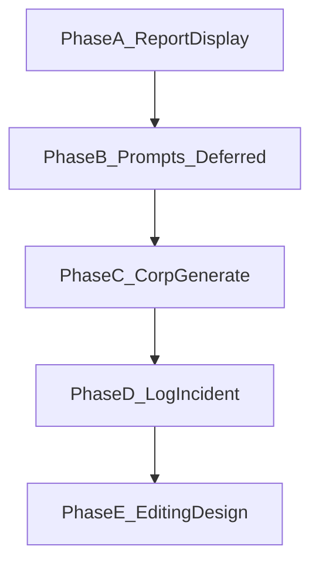

# Corp UX + report review plan

## Defaults

- **Corporation until auth:** manual select/dropdown (14 corps). Locking per-officer comes later with login — do not invent auth here.
- **Prompt sharpening (original thought #4):** out of scope for implementation here — this plan only reserves a follow-up plan (see Phase B).
- **Narrative editing:** design decision only in Phase E — no edit UI in this work. Review loop = view + `needs_review` + regenerate.
- **Forms:** use existing TanStack Form hook ([`apps/frontend/src/hooks/form.ts`](apps/frontend/src/hooks/form.ts) + [`apps/frontend/src/components/forms-components/`](apps/frontend/src/components/forms-components/)).

---

## Phase A — Report display (highest leverage, FE-only)

**Goal:** Make [`/reports/$reportId`](apps/frontend/src/routes/reports/$reportId.tsx) a real review surface.

**Backend:** none (reuse existing `GET /reports/{id}` fact_table + narrative + violations).

**Frontend work**

1. Replace scaffolding [`MarkdownPreview`](apps/frontend/src/components/shared/markdown-preview.tsx):
   - Add `react-markdown` (+ `remark-gfm` if needed).
   - Render with `@tailwindcss/typography` `prose` classes (already a dependency).
2. **Citation linking (client-side):**
   - Parse fact table: `fact_table.facts[]` with `citation.cid` (`C001`…), `metric`, `value`, `unit`, `verification`, `breakdown`, `citation.description`.
   - Fact table UI: real table (or definition list) with row anchors `id="citation-C001"`.
   - In rendered markdown/narrative, turn `[C001]` (and bare `C001` markers if present) into buttons/links that `scrollIntoView` the matching row and briefly highlight it (CSS flash class).
3. **Inline violations:**
   - Keep the violations summary card for `needs_review`.
   - Additionally, if `violation.sentence` is present, highlight that sentence in the narrative pane (mark/wrap) so reviewers see the bad text in context.
4. Layout: narrative (left/main) + fact table (right or below on mobile). Drop raw `JSON.stringify` dump.

**Files:** [`markdown-preview.tsx`](apps/frontend/src/components/shared/markdown-preview.tsx), new helpers under `src/components/reports/` (e.g. `fact-table.tsx`, `citation-link.tsx`, `violations-panel.tsx`), update [`$reportId.tsx`](apps/frontend/src/routes/reports/$reportId.tsx). Tighten FE `ReportDetail.fact_table` typing toward `{ facts: Fact[]; gaps?: string[] }` in [`types/dmcu.ts`](apps/frontend/src/types/dmcu.ts).

**Done when:** opening a report shows readable markdown, clickable citations scroll/highlight fact rows, and violations are visible both as a list and inline when sentence text matches.

---

## Phase B — Prompt / template sharpening (separate plan)

**Not implemented in this plan.** Create a dedicated follow-up plan later that:

- Reworks YAML narration prompts/sections in [`apps/backend/app/templates/definitions/`](apps/backend/app/templates/definitions/) to mirror example sitrep headers (`Present Activity`, `Alert Level`, `Situation Overview`, corp-by-corp paragraphs like Full Sitrep 2023).
- Uses docs under [`docs/examples/`](docs/examples/) as the source of truth.

This plan’s only commitment: do Phase A before that prompts plan so reviewers can read improved output.

---

## Phase C — Corp-simplified generate

**Goal:** Corp officer path without template picker: “my corporation + date range → `single_region_report`”.

**Backend:** none — reuse `POST /reports` with fixed `template: "single_region_report"`.

**Frontend**

1. Keep admin path at [`/reports/new`](apps/frontend/src/routes/reports/new.tsx): full template select + dynamic params from `GET /templates` via `useAppForm`.
2. Add corp path route `/reports/corp` (or `/reports/new` with clear tabs — prefer **separate route** for clarity):
   - Fields: corporation (select), `date_from`, `date_to`.
   - On submit: `createReport({ template: 'single_region_report', params })` then navigate to detail.
3. Sidebar/Overview CTAs: “Generate corp report” → `/reports/corp`; “Generate (admin)” → `/reports/new`.

**Done when:** corp form generates a report without exposing template names; admin form still supports both templates.

---

## Phase D — Log Incident (single-row sitrep entry)

**Goal:** Corp officer logs one incident without building a CSV.

**Backend first**

- Add `POST /incidents` (or `POST /ingest/sitreps/incident`) accepting JSON aligned to [`parse_sitrep_row`](apps/backend/app/modules/sitreps/ingest.py) fields + required `corporation`.
- Reuse normalize/upsert patterns from sitrep ingest (`source="sitreps"`, `global_id` strategy for single rows — e.g. UUID-based id when no Row ID).
- Return created/updated incident summary + canonical success shape.
- Tests for happy path + missing corporation.

**Frontend**

- New route `/incidents/new` (sidebar: “Log Incident”).
- Form via `useAppForm`: community, street, incident type, event date, injuries/deaths, damage text, relief checkboxes, corporation select.
- Keep CSV bulk upload on `/ingest` (implement that form in this phase or immediately after with same form convention — module + file + corporation for sitreps).
- Incidents **list browser** remains phase 1b (out of scope unless needed for smoke confirmation via overview counts).

**Done when:** submitting the form increases sitrep incident count on Overview; CSV ingest still works.

---

## Phase E — Editing safety (design only — no implementation)

**Decision for this plan:** do **not** ship narrative editing.

**Rules to record (for a future plan if stakeholders demand edit):**

- Free-text edit of the full narrative is unsafe — it can reintroduce invented numbers the citation checker exists to stop.
- If editing is required later: per-sentence (or per-section) edits only; citation markers locked/required; save path must re-run `check_citations` and can set `needs_review` / reject save on failure.
- Until then: allowed actions are **view**, **copy markdown**, and **regenerate** with new params.

No code for edit/save in this workstream.

---

## Suggested implementation order (this plan)

1. Phase A — report display
2. Phase C — corp generate (+ admin generate form while forms are open)
3. Phase D — single-incident API + Log Incident form (+ CSV ingest form)
4. Phase E — write short design note in repo docs or PR description (no feature)

Phase B prompts plan is scheduled **after** Phase A lands, as its own plan.

## Out of scope

- Auth / per-officer corp lock
- Prompt YAML rewrites (Phase B plan)
- Narrative edit UI
- Incidents data-table browser
- Metrics v2 / preparedness log
