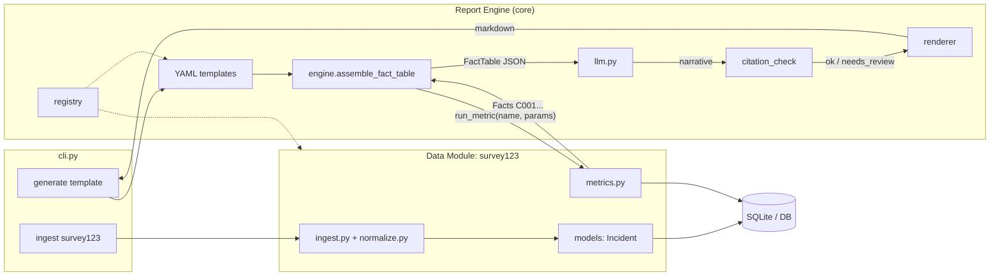

# DMCU Backend Demo — Flow Breakdown

**2-min talk track:** CSV goes into the `survey123` data module → DB. A YAML template tells the engine which metrics to pull → engine builds a cited **FactTable** → LLM only writes prose → citation checker validates numbers → markdown report.

## Flow

1. **Ingest** — Survey123 CSV → normalize, drop PII, upsert into `incidents`
2. **Template** — YAML lists required metrics + LLM prompt (e.g. `minister_regional_comparison`)
3. **Engine** — for each data requirement, calls `survey123.run_metric(...)` → builds FactTable with `C001`, `C002`, …
4. **LLM** — narrates from the fact JSON only (no inventing numbers)
5. **Citation check** — every figure must match a fact; fail once → retry; still fail → `needs_review`
6. **Render** — markdown + citation appendix

**Pitch line:** Numbers are deterministic from the data module; the LLM only wraps them in prose; citations are machine-checked.

## Diagram



## Commands

From `apps/backend`:

**One-time setup if needed:**

```bash
cd apps/backend
uv run alembic upgrade head
uv run python cli.py ingest survey123 fixtures/sample_small.csv
```

**Generate the report:**

```bash
uv run python cli.py generate minister_regional_comparison \
  --date-from 2024-06-01 \
  --date-to 2024-06-30
```

**Optional second template:**

```bash
uv run python cli.py generate single_region_report \
  --corporation sangre_grande_regional_corporat \
  --date-from 2024-06-01 \
  --date-to 2024-06-30
```

**List templates:**

```bash
uv run python cli.py list-templates
```

Markdown prints to stdout; `status: ok` / `needs_review` goes to stderr.
